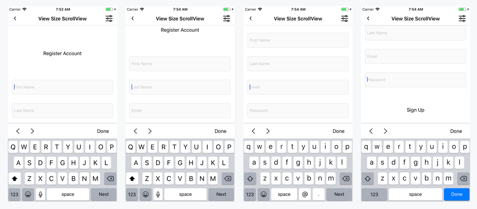
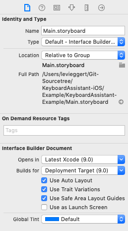

KeyboardAssistant
==============

Version 1.0.0

Keyboard Assistant faciliates in the repositioning of views when the device Keyboard is present.  It does this by observing keyboard notifications (willShow, didShow, willHide, didHide) and by responding to UITextField and UITextView objects when they begin editing. 

Note: Before reading any further, note that I use the word input and input item throughout this document.  I am referring to input items in the InputNavigator class which are of type UITextField and UITextView.

- [Requirements](#requirements)
- [Cocoapods Installation](#cocoapods)
- [Brief Overview Of Classes](#brief-overview-of-classes)
- [How To Use KeyboardAssistant](#how-to-use-keyboardassistant)
- [How To Use InputNavigator](#how-to-use-inputnavigator)
- [Structuring Your ScrollView](#structuring-your-scrollview)

### Requirements

- iOS 9.0+
- Xcode 10.1
- Swift 4.2

### Cocoapods

```ruby
source 'https://github.com/CocoaPods/Specs.git'
platform :ios, '9.0'
use_frameworks!

target '<Your Target Name>' do
    pod 'KeyboardAssistant', '1.0.0'
end
```

### Brief Overview Of Classes

KeyboardAssistant is broken into 3 core classes.  KeyboardObserver, InputNavigator, and KeyboardAssistant.  The KeyboardAssistant class is the main class you will be working with and sits on top of KeyboardObserver and InputNavigator.  Before using KeyboardAssistant, you will create an InputNavigator and inject it into the KeyboardAssistant.  InputNavigator handles navigation between inputs and is responsible for telling KeyboardAssistant about focus changes (when a UITextField or UITextView begins editing).  The KeyboardObserver class is responsible for checking keyboard state changes (willShow, didShow, willHide, didHide, didChangeFrame) and reports changes to the KeyboardAssistant. It is possible to use InputNavigator and KeyboardObserver separately if you wish.  However, that is not the intent of this module.  For repositioning input items above the device keyboard, you will be utilizing KeyboardAssistant.  To learn more about KeyboardAssistant, start in the How To Use KeyboardAssistant section below.

### How To Use KeyboardAssistant

There are 3 primary ways to use keyboard assistant.

1. [Auto ScrollView Assistant](#auto-scrollview-assistant): Automatically positions to input items within a scrollview.
2. [Manual ScrollView Assistant](#manual-scrollview-assistant): Provides dynamic positioning within a scrollview.  Position to buttons, or to the next input item.
3. [Manual Assistant](#manual-assistant): Most flexible.  A scrollview is not required.  Instead, you write the positioning code.

#### Auto ScrollView Assistant

The auto scrollview assistant will automatically position input items above the keyboard for you.  There is minimal code required to set it up, however, you will need to structure your viewcontroller classes to use a scrollview.

Before continuing any further, read more about how to [structure your scrollview](#structuring-your-scrollview).

In this example we will:
1. Create an InputNavigator with a default controller.  If you are unfamiliar with the InputNavigator than read more about it [here](#how-to-use-inputnavigator).
2. [Add](#adding-input-items) input items to the InputNavigator.
3. Create an auto scrollview assistant.

To get started creating the auto scrollview assistant.  First declare a KeyboardAssistant variable in your controller class.
```swift
import UIKit

class YourViewController: UIViewController
{
    // MARK: - Properties

    private var keyboardAssistant: KeyboardAssistant!
}
```

Next, make sure your controller is structured to use a scrollview for positioning.  You will need a reference to the scrollview that is positioned and the scrollview's bottom constraint which is placed at the top of the device keyboard by the keyboard assistant.
```swift
import UIKit

class YourViewController: UIViewController
{
    // MARK: - Properties

    private var keyboardAssistant: KeyboardAssistant!

    // MARK: - Outlets

    @IBOutlet weak var scrollView: UIScrollView!

    @IBOutlet weak var scrollViewBottomConstraint: NSLayoutConstraint!
}
```

The viewDidLoad() method is where you will complete the setup of your KeyboardAssistant.  First create an InputNavigator to use and add some inputs for navigation.
```swift
import UIKit

class YourViewController: UIViewController
{
    // MARK: - Properties

    private var keyboardAssistant: KeyboardAssistant!

    // MARK: - Outlets

    @IBOutlet weak var scrollView: UIScrollView!
    @IBOutlet weak var contentView: UIView!
    @IBOutlet weak var lbTitle: UILabel!
    @IBOutlet weak var txtFirstName: UITextField!
    @IBOutlet weak var txtLastName: UITextField!
    @IBOutlet weak var txtEmail: UITextField!
    @IBOutlet weak var txtPassword: UITextField!
    @IBOutlet weak var btRegisterAccount: UIButton!

    @IBOutlet weak var scrollViewBottomConstraint: NSLayoutConstraint!

    // MARK: - Life Cycle

    override func viewDidLoad()
    {
        super.viewDidLoad()

        let navigator: InputNavigator = InputNavigator.createWithDefaultController()
        navigator.addInputItems(inputItems: [self.txtFirstName, 
        self.txtLastName, 
        self.txtEmail, 
        self.txtPassword])
    }
}
```

Then create the KeyboardAssistant using the newly created InputNavigator.  There are 6 parameters for the auto scrollview assistant.
1. inputNavigator: Defines the navigation to use and the input items to be navigated and repositioned.
2. positionScrollView: The scrollview that will be repositioned. 
3. positionConstraint: There are 2 types of position constraints. (viewTopToTopOfScreen and viewBottomToTopOfKeyboard) which define how to position an input item.  Either position the top of the view to the top of the screen or the bottom of the view to the top of the keyboard.
4. positionOffset: This is an offset that will be applied after the view is positioned by the position constraint.  So if you use the position constraint viewTopToTopOfScreen, the view top will get positioned to the top of the device screen and then offset by the position offset.
5. bottomConstraint: This is the scrollview's bottom constraint.  It is set to the top of the keyboard.  This allows user's to scroll through all subviews without the keyboard interfering.
6. bottomConstraintLayoutView: This is required for changing the position of the bottomConstraint.  In most cases this will be the controller view property because it is the parent of the UIScrollView's bottom constraint.
```swift
import UIKit

class YourViewController: UIViewController
{
    // MARK: - Properties

    private var keyboardAssistant: KeyboardAssistant!

    // MARK: - Outlets

    @IBOutlet weak var scrollView: UIScrollView!
    @IBOutlet weak var contentView: UIView!
    @IBOutlet weak var lbTitle: UILabel!
    @IBOutlet weak var txtFirstName: UITextField!
    @IBOutlet weak var txtLastName: UITextField!
    @IBOutlet weak var txtEmail: UITextField!
    @IBOutlet weak var txtPassword: UITextField!
    @IBOutlet weak var btRegisterAccount: UIButton!

    @IBOutlet weak var scrollViewBottomConstraint: NSLayoutConstraint!

    // MARK: - Life Cycle

    override func viewDidLoad()
    {
        super.viewDidLoad()

        let navigator: InputNavigator = InputNavigator.createWithDefaultController()
        navigator.addInputItems(inputItems: [
        self.txtFirstName, 
        self.txtLastName, 
        self.txtEmail, 
        self.txtPassword])

        self.keyboardAssistant = KeyboardAssistant.createAutoScrollView(
        inputNavigator: navigator, 
        positionScrollView: self.scrollView, 
        positionConstraint: .viewBottomToTopOfKeyboard, 
        positionOffset: 30, 
        bottomConstraint: self.scrollViewBottomConstraint, 
        bottomConstraintLayoutView: self.view)
    }
}
```

Lastly, you will need to manage the lifecycle of registered notifications.  This is done through the KeyboardAssistant start and stop methods.
```swift
override func viewWillAppear(_ animated: Bool)
{
    super.viewWillAppear(animated)

    self.keyboardAssistant.start()
}

override func viewWillDisappear(_ animated: Bool)
{
    super.viewWillAppear(animated)

    self.keyboardAssistant.stop()
}
```

That's all there is to it.  Whenever one of the input items is active, it will be repositioned for you.

#### Manual ScrollView Assistant

The manual assistant can be used for manualy positioning a scrollview.

Take a look at the below screenshot.  This is what we want to achieve.  Whenever an input item is focused, we want to position to the next input item.  If we are on the last input item, position to the sign up button.



In the code below we will:
1. Create an InputNavigator with both keyboard navigation and default controller navigation.
2. Add input items to navigate through.
3. Create a manual assistant.
4. Manage the keyboard assistant notifications, start and stop.

```swift
import UIKit

class YourViewController: UIViewController
{
    // MARK: - Properties

    private var keyboardAssistant: KeyboardAssistant!

    // MARK: - Outlets

    @IBOutlet weak var scrollView: UIScrollView!
    @IBOutlet weak var contentView: UIView!
    @IBOutlet weak var lbTitle: UILabel!
    @IBOutlet weak var txtFirstName: UITextField!
    @IBOutlet weak var txtLastName: UITextField!
    @IBOutlet weak var txtEmail: UITextField!
    @IBOutlet weak var txtPassword: UITextField!
    @IBOutlet weak var btRegisterAccount: UIButton!

    @IBOutlet weak var scrollViewBottomConstraint: NSLayoutConstraint!

    // MARK: - Life Cycle

    override func viewDidLoad()
    {
        super.viewDidLoad()

        let navigator: InputNavigator = InputNavigator.createWithKeyboardNavigationAndDefaultController(shouldSetTextFieldDelegates: true)
        navigator.addInputItems(inputItems: [
        self.txtFirstName, 
        self.txtLastName, 
        self.txtEmail, 
        self.txtPassword])
        
        self.keyboardAssistant = KeyboardAssistant.createManual(
        inputNavigator: navigator,
        delegate: self,
        bottomConstraint: self.scrollViewBottomConstraint,
        bottomConstraintLayoutView: self.view)
    }

    override func viewWillAppear(_ animated: Bool)
    {
        super.viewWillAppear(animated)

        self.keyboardAssistant.start()
    }

    override func viewWillDisappear(_ animated: Bool)
    {
        super.viewWillAppear(animated)

        self.keyboardAssistant.stop()
    }
}
```

We use the KeyboardAssistantDelegate: keyboardAssistantManuallyReposition() to do all manual positioning.  If there is a nextInputItem then position to it.  Otherwise we are at the end so position to the sign up button. 

We pass shouldLoop: false into getNextInputItem.  If true were passed, it would return the first input item when on the last input item.
```swift
// MARK: - KeyboardAssistantDelegate

extension YourViewController: KeyboardAssistantDelegate
{
    func keyboardAssistantManuallyReposition(keyboardAssistant: KeyboardAssistant, toInputItem: UIView, keyboardHeight: CGFloat)
    {
        let constraint: KeyboardAssistant.RepositionConstraint = .viewBottomToTopOfKeyboard
        let offset: CGFloat = 20

        if let nextInputItem = keyboardAssistant.navigator.getNextInputItem(inputItem: toInputItem, shouldLoop: false)
        {
            keyboardAssistant.reposition(scrollView: self.scrollView, toInputItem: nextInputItem, constraint: constraint, offset: offset)
        }
        else
        {
            keyboardAssistant.reposition(scrollView: self.scrollView, toInputItem: self.btRegisterAccount, constraint: constraint, offset: offset)
        }
    }
}
```

This achieves the same thing, but is a hard-coded approach.
```swift
// MARK: - KeyboardAssistantDelegate

extension YourViewController: KeyboardAssistantDelegate
{
    func keyboardAssistantManuallyReposition(keyboardAssistant: KeyboardAssistant, toInputItem: UIView, keyboardHeight: CGFloat)
    {
        let constraint: KeyboardAssistant.RepositionConstraint = .viewBottomToTopOfKeyboard
        let offset: CGFloat = 20

        if (toInputItem == self.txtFirstName)
        {
            keyboardAssistant.reposition(scrollView: self.scrollView, toInputItem: self.txtLastName, constraint: constraint, offset: offset)
        }
        else if (toInputItem == self.txtLastName)
        {
            keyboardAssistant.reposition(scrollView: self.scrollView, toInputItem: self.txtEmail, constraint: constraint, offset: offset)
        }
        else if (toInputItem == self.txtEmail)
        {
            keyboardAssistant.reposition(scrollView: self.scrollView, toInputItem: self.txtPassword, constraint: constraint, offset: offset)
        }
        else if (toInputItem == self.txtPassword)
        {
            keyboardAssistant.reposition(scrollView: self.scrollView, toInputItem: self.btRegisterAccount, constraint: constraint, offset: offset)
        }
    }
}
```

#### Manual Assistant

Create a manual assistant when you want to do your own positioning.

In the code below we will:
1. Create an InputNavigator with both keyboard navigation and default controller navigation.
2. Add input items to navigate through.
3. Create a manual assistant.
4. Manage the keyboard assistant notifications, start and stop.
5. Add the KeyboardAssistantDelegate: keyboardAssistantManuallyReposition() to perform manual positioning. 

```swift
import UIKit

class YourViewController: UIViewController
{
    // MARK: - Properties

    private var keyboardAssistant: KeyboardAssistant!

    // MARK: - Outlets

    @IBOutlet weak var txtFirstName: UITextField!
    @IBOutlet weak var txtLastName: UITextField!
    @IBOutlet weak var txtEmail: UITextField!
    @IBOutlet weak var txtPassword: UITextField!
    @IBOutlet weak var btRegisterAccount: UIButton!

    // MARK: - Life Cycle

    override func viewDidLoad()
    {
        super.viewDidLoad()

        let navigator: InputNavigator = InputNavigator.createWithKeyboardNavigationAndDefaultController(shouldSetTextFieldDelegates: true)
        navigator.addInputItems(inputItems: [
        self.txtFirstName, 
        self.txtLastName, 
        self.txtEmail, 
        self.txtPassword])
        
        self.keyboardAssistant = KeyboardAssistant.createManual(inputNavigator: navigator, delegate: self)
    }

    override func viewWillAppear(_ animated: Bool)
    {
        super.viewWillAppear(animated)

        self.keyboardAssistant.start()
    }

    override func viewWillDisappear(_ animated: Bool)
    {
        super.viewWillAppear(animated)

        self.keyboardAssistant.stop()
    }
}

// MARK: - KeyboardAssistantDelegate

extension YourViewController: KeyboardAssistantDelegate
{
    func keyboardAssistantManuallyReposition(keyboardAssistant: KeyboardAssistant, toInputItem: UIView, keyboardHeight: CGFloat)
    {
        // Do your manual positioning here.
    }
}
```

#### How To Use InputNavigator

- [Create with Default Controller](#create-with-default-controller)
- [Create with Keyboard Navigation](#create-with-keyboard-navigation)
- [Create with Custom Controller](#create-with-custom-controller)
- [Create with Custom Accessory View](#create-with-custom-accessory-view)
- [Create with Keyboard Navigation and Default Controller](#create-with-keyboard-navigation-and-default-controller)
- [Create with Keyboard Navigation and Custom Controller](#create-with-keyboard-navigation-and-custom-controller)
- [Create with Keyboard Navigation and Custom Accessory View](#create-with-keyboard-navigation-and-custom-accessory-view)
- [Adding Input Items](#adding-input-items)

InputNavigator get's its own section because there is actually quite a lot to this class and there are quite a few different ways you can configure the InputNavigator.

Before jumping into the code.  It's probably best I give a brief overview of the responsibilities of this class.  The main purprose of this class is to handle and provide navigation between input items (UITextField / UITextView).  InputNavigator is fully flexible, meaning you can choose to use the built in navigation options or provide your own.  There are two built in options, keyboard return key and DefaultNavigationView. Both can be used together, separately, or not at all.  You can provide your own custom views for navigation which get attached to the input item's inputAccessoryView and even use this alongside the keyboard return key if you choose.  There are a lot of options at your disposal. 

Let's start with the built-in options and expand on those.

##### Create With Default Controller


We'll start with the default controller.  DefaultNavigationView is a custom view class that comes with the KeyboardAssistant module and has it's own .xib file for creating the UI.  It has 3 primary buttons, btPrev, btNext, and btDone.  The prev and next buttons are for navigating input items and the done button will close the keyboard by resigning the active input item.  To create a navigator with the default controller, use the static method as shown in the example below.

```swift
override func viewDidLoad()
{
    super.viewDidLoad()
    
    let navigator: InputNavigator = InputNavigator.createWithDefaultController()
}
```

Editing the default controller is easy.

```swift
override func viewDidLoad()
{
    super.viewDidLoad()

    let navigator: InputNavigator = InputNavigator.createWithDefaultController()
    
    // change all button colors
    navigator.defaultController?.setButtonColors(color: .red)
    
    // you can also configure the default controller in anyway you like.
    if let defaultController = navigator.defaultController
    {
        // remove the top shadow or change the top shadow in anyway you want
        defaultController.layer.shadowOpacity = 0
        
        // edit individual buttons
        defaultController.btPrev.backgroundColor = .lightGray
        defaultController.btNext.backgroundColor = .lightGray
        defaultController.btDone.backgroundColor = .lightGray
        defaultController.setBtPrevColor(color: .white)
        defaultController.setBtNextColor(color: .white)
        defaultController.setBtDoneColor(color: .black)
    }
}
```

##### Create With Keyboard Navigation


The next built in navigation option is keyboard navigation which uses the keyboard's return key.  When a UITextField is being edited the returnKeyType will either be set to next or done depending on the index position of the UITextField in the inputItems list.  If the UITextField being edited is at the end of the list, it's returnKeyType is set to done, otherwise it's set to next.  When a returnKeyType of next is tapped, InputNavigator will move to the next inputItem, if done is tapped, the current inputItem is resigned and the keyboard will hide. 

Note: The returnKeyType will not be set on UITextView objects.  This was done on purpose because the return key can be used for adding new lines to a UITextView.  If you need to navigate from UITextView's then think about using the default controller or a custom navigation of your own.

Important! When creating an InputNavigator with keyboard navigation, there is a Bool flag called `shouldSetTextFieldDelegates`.  If true is passed, InputNavigator will set the UITextField delegate property in order to respond to the textFieldShouldReturn delegate method.  If you need use UITextFieldDelegate in your controller then pass false here and make sure to call the InputNavigator's textFieldShouldReturn method to forward navigation.  You can see an example of this in the code samples below.

This is how you create an InputNavigator with keyboard navigation.  Passing true here will set all UITextField delegate's to the InputNavigator.
```swift
override func viewDidLoad()
{
    super.viewDidLoad()
    
    let navigator: InputNavigator = InputNavigator.createWithKeyboardNavigation(shouldSetTextFieldDelegates: true)
}
```

If your controller class need's to use UITextFieldDelegate, then set the flag to false and make sure you call textFieldShouldReturn on the InputNavigator.
```swift
class YourViewController: UIViewController
{
    // MARK: - Properties

    private var keyboardAssistant: KeyboardAssistant!
    
    override func viewDidLoad()
    {
        super.viewDidLoad()

        let navigator: InputNavigator = InputNavigator.createWithKeyboardNavigation(shouldSetTextFieldDelegates: false)
    }
}

// MARK: - UITextFieldDelegate

extension YourViewController: UITextFieldDelegate
{
    func textFieldShouldReturn(_ textField: UITextField) -> Bool
    {        
        _ = self.keyboardAssistant.navigator.textFieldShouldReturn(textField)

        return true
    }
}
```

##### Create With Custom Controller

##### Create With Custom Accessory View

#### Create With Keyboard Navigation And Default Controller

#### Create With Keyboard Navigation And Custom Controller

#### Create With Keyboard Navigation And Custom Accessory View

#### Adding Input Items

- [Back To How To Use KeyboardAssistant](#how-to-use-keyboardassistant)

### Structuring Your ScrollView

For Keyboard positioning, I prefer to use the scrollview approach.  There are a few major reasons for this.  
1. It's a lot more user friendly because it allows users to scroll through input while the keyboard is open.  
2. It's much easier to manage than say a tableview.  TableViews are great, but when collecting input from users they can become a pain to manage.  This is because as you scroll through a tableview, cells are getting recycled.  This adds extra management to collect input and extra management to navigate input.
3. I end up having to use a scrollview on most my viewcontrollers anyways to handle shorter device sizes.

Before you begin structuring your scrollview, make sure that in your storyboard document Use Safe Area Layout Guides is checked.  Safe area is replacing top and bottom layout guides.



Here is how you will need to structure your viewcontroller view hier-archy.  UIView [root / UIViewController.view]  >  UIScrollView [scrollView]  >  UIView [contentView].

UIScrollView should set all edge constraints to the safe area. 
UIView [contentView] should set all edge constraints to the UIScrollView and also set equal widths to UIScrollView.

That's it.  Then all your custom UI goes inside the UIView [contentView].  

Note:  This setup uses auto layout to determine the scrollview's content size.  That means, all of your subviews inside of the UIView [contentView] need to provide top and bottom constraints so the contentView's height can be satisfied.  It will also require some of your subviews height contraints to be set.  Unless ofcourse, their height is determined by their subviews.  If you are unfamiliar with this concept read more about autolayout. 

The below screenshot is an example of this structure.  The constraints on the right show how to setup the UIScrollView and UIView [contentView] constraints.


Lastly, make sure to connect the scrollview's bottom constrant to an outlet.  This constraint is positoned at the top of the keyboard allowing the entire view to be scrolled through without the keyboard getting in the way.


- [Back To Auto ScrollView Assistant](#auto-scrollview-assistant)
- [Back To Manual ScrollView Assistant](#manual-scrollview-assistant)
