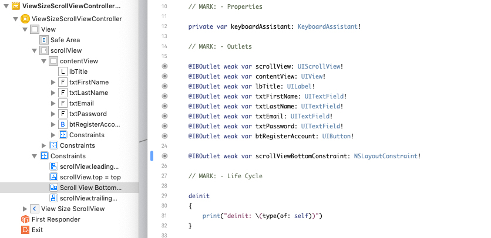
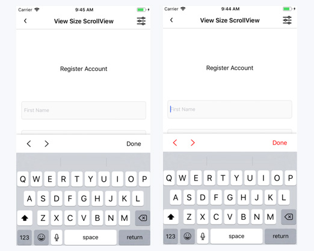
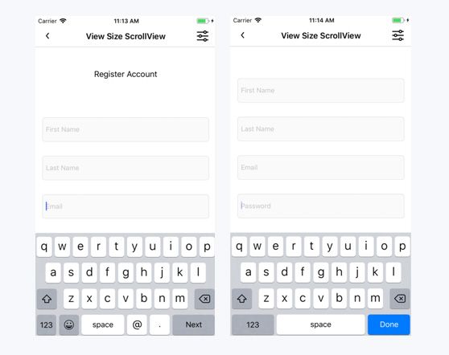

KeyboardAssistant
==============

Version 1.0.0

Keyboard Assistant faciliates in the repositioning of views when the device Keyboard is present.  It does this by observing keyboard notifications (willShow, didShow, willHide, didHide) and by responding to UITextField and UITextView objects when they begin editing. 

- [Requirements](#requirements)
- [Cocoapods Installation](#cocoapods)
- [Documentation](#documentation)
- [How to use](#how-to-use)
- [Configuring InputNavigator](#configuring-inputnavigator)

### Requirements

- iOS 9.0+
- Xcode 10.1
- Swift 4.2

### Cocoapods

```ruby
source 'https://github.com/CocoaPods/Specs.git'
platform :ios, '9.0'
use_frameworks!

target '<Your Target Name>' do
    pod 'KeyboardAssistant', '1.0.0'
end
```

### Documentation

KeyboardAssistant is broken into 3 core classes.  KeyboardObserver, InputNavigator, and KeyboardAssistant.  KeyboardAssistant acts as a layer on top of KeyboardObserver and InputNavigator and depends on these 2 classes.  You can read more about these classes and their responsibilities below.

* KeyboardObserver, as the name of this class states, has the sole responsibility of observing the device Keyboard.  It will register keyboard notifications (willShow, didShow, willHide, didHide, didChangeFrame) and retrieve the height of the keyboard.  Its job is to tell the observee (KeyboardAssistant) about keyboard state changes and height changes. 

* InputNavigator manages a sequence of input and is responsible for creating and handling the navigation between these inputs.  On iOS, input can be obtained from user's by using UITextField and UITextView objects.  This class supports both UITextField and UITextView.  To handle navigation between these inputs, Input Navigator can be configured to use the keyboard return key, it can also use a custom accessory view that conforms to InputNavigatorAccessoryController, or you can create your own custom input accessory view of type UIView and directly call InputNavigator's navigation methods.

- KeyboardAssistant is the main class you will be working with.  It holds an observer (KeyboardObserver) and navigator (InputNavigator) and handles repositioning views when the keyboard height changes and when new input items are navigated to.

### How to use

This section is broken up into the following parts.
1. How to structure your controller for keyboard positioning.
2. How to create and use the auto scrollview assistant.
3. How to create and use the manual assistant.

#### Structuring your UIViewController for UIScrollView positioning

For Keyboard positioning, I prefer to use the UIScrollView approach.  There are a few major reasons for this.  
1. It's a lot more user friendly because it allows user's to scroll through input while the keyboard is open.  
2. It's much easier to manage than say a UITableView.  UITableView's are great, but when collecting input from user's they can become a pain to manage.  This is because as you scroll through a UITableView, cell's are getting recycled.  Extra management is required to collect input from UITextFields as well as navigating to previous and next textfield input items.  
3. I end up having to use a UIScrollView on most my view controllers anyways to handle shorter device sizes.

Here is how you will need to structure your controller view hier-archy.  UIView [root / UIViewController.view]  >  UIScrollView [scrollView]  >  UIView [contentView].

UIScrollView should set all edge constraints to the UIView [root / UIViewController.view].
UIView [contentView] should set all edge constraints to the UIScrollView and also set equal widths to UIScrollView.

That's it.  Then all your custom UI goes inside the UIView [contentView].  

Note:  This setup uses auto layout to determine the UIScrollView's content size.  That means, all of your subviews inside of the UIView [contentView] need to provide top and bottom constraints so the contentView's height can be satisfied.  It will also require some of your subviews height contraints to be set.  Unless ofcourse, their height is determined by their subviews.  If you are unfamiliar with this concept read more about autolayout. 

The below screenshot is an example of this structure.  The constraints on the right show how to setup the UIScrollView and UIView [contentView] constraints.


Lastly, make sure to connect the UIScrollView's bottom constrant to an outlet.  This constraint is positoned at the top of the keyboard allowing the entire view to be scrolled through without the keyboard getting in the way.



#### Auto ScrollView Assistant:

This section will describe how to build the auto scrollview assistant.  It requires that you structure your UIViewController with a scrollview and contentview.  Read about [Structuring your UIViewController for UIScrollView positioning](#structuring-your-uiviewcontroller-for-uiscrollview-positioning).

This example shows how to:
1. Create an InputNavigator with a default controller.
2. Add input items to the InputNavigator.
3. Create an auto scrollview KeyboardAssistant.

```swift
import UIKit

class YourViewController: UIViewController
{
    // MARK: - Properties

    private var keyboardAssistant: KeyboardAssistant!
    
    // MARK: - Outlets
    
    @IBOutlet weak var scrollView: UIScrollView!
    @IBOutlet weak var contentView: UIView!
    @IBOutlet weak var lbTitle: UILabel!
    @IBOutlet weak var txtFirstName: UITextField!
    @IBOutlet weak var txtLastName: UITextField!
    @IBOutlet weak var txtEmail: UITextField!
    @IBOutlet weak var txtPassword: UITextField!
    @IBOutlet weak var btRegisterAccount: UIButton!
    
    @IBOutlet weak var scrollViewBottomConstraint: NSLayoutConstraint!
    
    // MARK: - Life Cycle
    
    override func viewDidLoad()
    {
        super.viewDidLoad()
    
        let navigator: InputNavigator = InputNavigator.createWithDefaultController()
        navigator.addInputItems(inputItems: [self.txtFirstName, 
        self.txtLastName, 
        self.txtEmail, 
        self.txtPassword])
    
        self.keyboardAssistant = KeyboardAssistant.createAutoScrollViewKeyboardAssistant(inputNavigator: navigator, 
        positionScrollView: self.scrollView, 
        positionConstraint: .viewBottomToTopOfKeyboard, 
        positionOffset: 30, 
        bottomConstraint: self.scrollViewBottomConstraint, 
        bottomConstraintLayoutView: self.view)
    }
}
```

#### Manual ScrollView Assistant:

#### Manual Assistant:

#### Configuring InputNavigator

- [Create with Default Controller](#create-with-default-controller)
- [Create with Keyboard Navigation](#create-with-keyboard-navigation)
- [Create with Custom Controller](#create-with-custom-controller)
- [Create with Custom Accessory View](#create-with-custom-accessory-view)
- [Create with Keyboard Navigation and Default Controller](#create-with-keyboard-navigation-and-default-controller)
- [Create with Keyboard Navigation and Custom Controller](#create-with-keyboard-navigation-and-custom-controller)
- [Create with Keyboard Navigation and Custom Accessory View](#create-with-keyboard-navigation-and-custom-accessory-view)
- [Adding Input Items](#adding-input-items)

InputNavigator get's its own section because there is actually quite a lot to this class and there are quite a few different ways you can configure the InputNavigator.

Before jumping into the code.  It's probably best I give a brief overview of the responsibilities of this class.  The main purprose of this class is to handle and provide navigation between input items (UITextField / UITextView).  InputNavigator is fully flexible, meaning you can choose to use the built in navigation options or provide your own.  There are two built in options, keyboard return key and DefaultNavigationView. Both can be used together, separately, or not at all.  You can provide your own custom views for navigation which get attached to the input item's inputAccessoryView and even use this alongside the keyboard return key if you choose.  There are a lot of options at your disposal. 

Let's start with the built-in options and expand on those.

##### Create with Default Controller



We'll start with the default controller.  DefaultNavigationView is a custom view class that comes with the KeyboardAssistant module and has it's own .xib file for creating the UI.  It has 3 primary buttons, btPrev, btNext, and btDone.  The prev and next buttons are for navigating input items and the done button will close the keyboard by resigning the active input item.  To create a navigator with the default controller, use the static method as shown in the example below.

```swift
override func viewDidLoad()
{
    super.viewDidLoad()
    
    let navigator: InputNavigator = InputNavigator.createWithDefaultController()
}
```

Editing the default controller is easy.

```swift
override func viewDidLoad()
{
    super.viewDidLoad()

    let navigator: InputNavigator = InputNavigator.createWithDefaultController()
    
    // change all button colors
    navigator.defaultController?.setButtonColors(color: .red)
    
    // you can also configure the default controller in anyway you like.
    if let defaultController = navigator.defaultController
    {
        // remove the top shadow or change the top shadow in anyway you want
        defaultController.layer.shadowOpacity = 0
        
        // edit individual buttons
        defaultController.btPrev.backgroundColor = .lightGray
        defaultController.btNext.backgroundColor = .lightGray
        defaultController.btDone.backgroundColor = .lightGray
        defaultController.setBtPrevColor(color: .white)
        defaultController.setBtNextColor(color: .white)
        defaultController.setBtDoneColor(color: .black)
    }
}
```

##### Create with Keyboard Navigation



The next built in navigation option is keyboard navigation which uses the keyboard's return key.  When a UITextField is being edited the returnKeyType will either be set to next or done depending on the index position of the UITextField in the inputItems list.  If the UITextField being edited is at the end of the list, it's returnKeyType is set to done, otherwise it's set to next.  When a returnKeyType of next is tapped, InputNavigator will move to the next inputItem, if done is tapped, the current inputItem is resigned and the keyboard will hide. 

Note: The returnKeyType will not be set on UITextView objects.  This was done on purpose because the return key can be used for adding new lines to a UITextView.  If you need to navigate from UITextView's then think about using the default controller or a custom navigation of your own.

Important! When creating an InputNavigator with keyboard navigation, there is a Bool flag called `shouldSetTextFieldDelegates`.  If true is passed, InputNavigator will set the UITextField delegate property in order to respond to the textFieldShouldReturn delegate method.  If you need use UITextFieldDelegate in your UIViewController then pass false here and make sure to call the InputNavigator's textFieldShouldReturn method to forward navigation.  You can see an example of this in the code samples below.

This is how you create an InputNavigator with keyboard navigation.  Passing true here will set all UITextField delegate's to the InputNavigator.
```swift
override func viewDidLoad()
{
    super.viewDidLoad()
    
    let navigator: InputNavigator = InputNavigator.createWithKeyboardNavigation(shouldSetTextFieldDelegates: true)
}
```

If your UIViewController class need's to use UITextFieldDelegate, then set the flag to false and make sure you call textFieldShouldReturn on the InputNavigator.
```swift
class YourViewController: UIViewController
{
    // MARK: - Properties

    private var keyboardAssistant: KeyboardAssistant!
    
    override func viewDidLoad()
    {
        super.viewDidLoad()

        let navigator: InputNavigator = InputNavigator.createWithKeyboardNavigation(shouldSetTextFieldDelegates: false)
    }
}

// MARK: - UITextFieldDelegate

extension YourViewController: UITextFieldDelegate
{
    func textFieldShouldReturn(_ textField: UITextField) -> Bool
    {        
        _ = self.keyboardAssistant.navigator.textFieldShouldReturn(textField)

        return true
    }
}
```

##### Create with Custom Controller

##### Create with Custom Accessory View

#### Create with Keyboard Navigation and Default Controller

#### Create with Keyboard Navigation and Custom Controller

#### Create with Keyboard Navigation and Custom Accessory View

#### Adding Input Items
